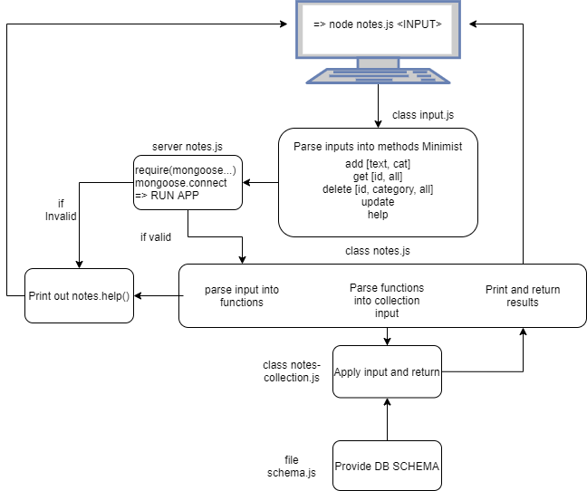

# LAB 04 - Notes
 A terminal based (CLI) notes application allowing users to easily create and manage a list of categorized notes

## Project Details
Author: Yahya Abu Khalil
Links and Resources
[submission PR](https://github.com/abukhalil-LTUC-ASAC/notes/pull/5)
[Github actions](https://github.com/abukhalil-LTUC-ASAC/notes/actions/runs/247075741)

### Modules
- [`input.js`](lib/model/input.js) 
- [`notes.js`](lib/model/notes.js)

### Setup
Clone the repo, and run the following commands to install the required dependencies and dev dependencies. 
- `npm install` to download all that exists in `package.json`.
- Make sure to have proper mongoose service started with `sudo service mongod start` for windows WSL2, otherwise check [this link](https://codefellows.github.io/setup-guide/code-401-javascript/5-mongo.html).

### Running the app
type --help to print all the commands available.

`node notes.js` + 
-  `-a/--add <note> -c <category><optional>`  - adds the following note followed by an optional category
-  `--get<ID><optional>`                      - gets the specified note using its ID, leave empty to get all notes
-  `--delete <ID>`                            - deletes the specified note by its ID
-  `--clear <category><optional>`             - deletes specific category or all notes if left empty
-  `--update "<ID>,<note>,<category>`         - updates the specified note by ID, with the specified note and category strings
  
Unit testing with: npm test using supergoose made by codefellows. 

### Unified Modeling Language (UML)

